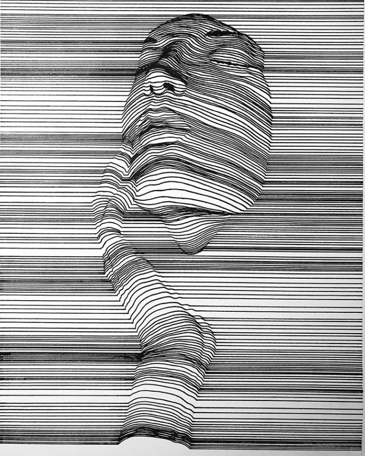
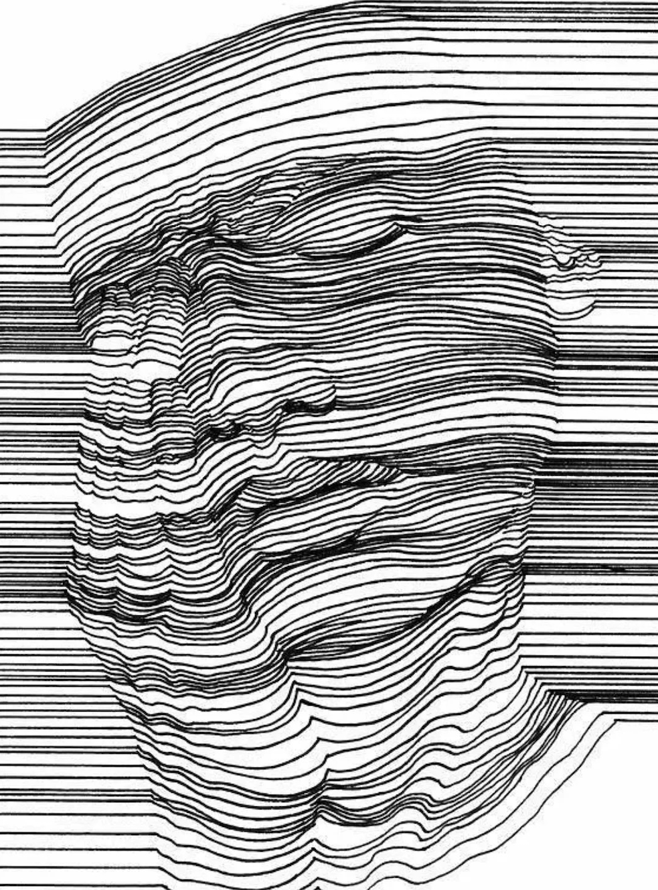

# Part 1: Imaging Technique Inspiration

### My favorite illustrator Nester Formentera's works can serve as inspiration for my major project. The two pictures below are both his works.

### This website allows you to see more of his line art works.
[Nester Formentera](https://nesterformentera.com/)

### However, Nester Formentera's artworks are too complex to encode, so based on this, I found two images that are relatively easy to implement through encoding techniques.

### I think randomly generating waves of varying sizes in dense lines is a great visual effect, even allowing users to interact with the lines. For example, generating waves by clicking with the mouse, or generating waves by swiping the mouse over places, and so on.

# Part 2: Coding Technique Exploration

### To realize these visual effects, I leveraged the **Perlin Noise** encoding technique, which is effective for generating smooth and natural-looking waveforms. You can explore similar code at the following link:
- [Perlin Noise Example on p5.js](https://p5js.org/examples/repetition-noise/)

### Below is a screenshot of the code running.

### If you want to increase the interaction effect (user clicks), I found the relevant code.
- [Interactive Wave Code on CodePen](https://codepen.io/___yskm___/pen/zKGPEB)

### After clicking the circle, its velocity increases, causing it to move up and down. The position updates through velocity and acceleration, creating a wave effect. Each circle adjusts its position based on adjacent circles, generating bouncing waves that propagate along the line.

### Below is a screenshot of the code running.

